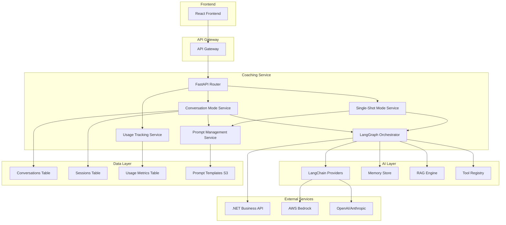

# 🏗️ PurposePath Coaching Service - Future Architecture Design

## 📊 Current State Analysis

### **Existing Strengths**
- ✅ **Conversation Management**: Well-structured conversation service with tenant isolation
- ✅ **Prompt System**: YAML-based prompt templates with versioning
- ✅ **Multi-provider Support**: Abstracted LLM provider interface (Bedrock)
- ✅ **Business Data Integration**: Established patterns for business context
- ✅ **Pydantic Models**: Good use of type safety in many areas
- ✅ **Repository Pattern**: Clean data access layer with tenant isolation

### **Current Limitations**
- 🔴 **Single Provider**: Only Bedrock, needs LangChain/LangGraph integration
- 🔴 **Manual Conversation Flow**: No automated conversation orchestration
- 🔴 **Limited Prompt Management**: Static YAML files, no admin interface
- 🔴 **No Usage Tracking**: Missing AI usage and token limit enforcement
- 🔴 **Mixed Architecture**: Both conversational and single-shot in same service
- 🔴 **No Advanced AI Features**: Missing memory, RAG, tool calling

---

## 🎯 Future Architecture Vision

### **Design Principles**
1. **🤖 Dual Mode Operation**: Clear separation between conversational and single-shot modes
2. **🔌 LangChain Integration**: Full LangGraph orchestration for complex workflows
3. **📊 Admin-Configurable**: Dynamic prompts, models, and limits via admin interface
4. **📈 Usage Tracking**: Complete AI usage monitoring and tenant limits
5. **🧠 Advanced AI Features**: Memory, RAG, tool calling, and agent workflows
6. **🏗️ Microservice Architecture**: Clean separation of concerns with API contracts

---

## 🏛️ Target Architecture

### **High-Level Architecture**


### **Core Services Architecture**

#### **1. Conversation Mode Service** (Interactive AI Coaching)
```python
class ConversationModeService:
    """Handles interactive coaching conversations with state management."""
    
    async def initiate_conversation(
        self,
        topic: CoachingTopic,
        business_context: Optional[BusinessContext] = None
    ) -> ConversationSession
    
    async def process_message(
        self,
        session_id: str,
        message: str
    ) -> ConversationResponse
    
    async def complete_conversation(
        self,
        session_id: str
    ) -> ConversationOutcome
```

#### **2. Single-Shot Mode Service** (One-time AI Analysis)
```python
class SingleShotModeService:
    """Handles single-shot AI analysis without conversation state."""
    
    async def analyze_strategy_alignment(
        self,
        strategy: StrategyInput,
        business_context: BusinessContext
    ) -> StrategyAnalysisResult
    
    async def generate_insights(
        self,
        data_context: DataContext,
        analysis_type: AnalysisType
    ) -> InsightsResult
```

#### **3. LangGraph Orchestrator** (AI Workflow Engine)
```python
class LangGraphOrchestrator:
    """Orchestrates complex AI workflows using LangGraph."""
    
    async def execute_conversational_workflow(
        self,
        session: ConversationSession,
        user_input: str
    ) -> WorkflowResult
    
    async def execute_analysis_workflow(
        self,
        analysis_request: AnalysisRequest
    ) -> AnalysisResult
```

#### **4. Dynamic Prompt Management**
```python
class PromptManagementService:
    """Manages dynamic prompts with admin configuration."""
    
    async def get_prompt_template(
        self,
        topic: CoachingTopic,
        version: Optional[str] = None
    ) -> PromptTemplate
    
    async def update_prompt_template(
        self,
        admin_context: AdminContext,
        template: PromptTemplateUpdate
    ) -> PromptTemplate
```

#### **5. Usage Tracking & Limits**
```python
class UsageTrackingService:
    """Tracks AI usage and enforces tenant limits."""
    
    async def track_usage(
        self,
        tenant_id: str,
        model_id: str,
        tokens_used: int,
        cost: Decimal
    ) -> UsageRecord
    
    async def check_limits(
        self,
        tenant_id: str,
        requested_tokens: int
    ) -> LimitCheckResult
```

---

## 🔄 Coaching Modes Implementation

### **Mode 1: Conversational Coaching**

#### **Flow Architecture**
```python
# Frontend Request
ConversationRequest(
    topic="core_values",
    business_context=BusinessContext(...),
    session_config=SessionConfig(...)
)

# LangGraph Workflow
@workflow
class ConversationalCoachingWorkflow:
    def __init__(self):
        self.memory = ConversationMemory()
        self.prompt_manager = PromptManager()
        self.business_context = BusinessContextManager()
    
    async def start_conversation(self, request: ConversationRequest):
        # Initialize conversation state
        # Load dynamic prompt template
        # Set up conversation memory
        # Begin coaching flow
        
    async def process_turn(self, user_message: str):
        # Update conversation memory
        # Determine conversation phase
        # Generate contextual response
        # Update conversation state
        # Check completion criteria
```

#### **Conversation State Management**
```python
class ConversationState(BaseModel):
    session_id: str
    topic: CoachingTopic
    current_phase: ConversationPhase
    conversation_memory: List[Message]
    business_context: BusinessContext
    user_insights: Dict[str, Any]
    completion_criteria: CompletionCriteria
    usage_metrics: UsageMetrics
```

### **Mode 2: Single-Shot Analysis**

#### **Analysis Workflow**
```python
@workflow
class SingleShotAnalysisWorkflow:
    def __init__(self):
        self.analyzers = AnalyzerRegistry()
        self.business_data = BusinessDataManager()
    
    async def analyze_strategy_alignment(
        self,
        strategy: StrategyInput,
        business_context: BusinessContext
    ):
        # Load business context
        # Apply analysis prompt
        # Generate insights
        # Return structured results
```

#### **Analysis Types**
```python
class AnalysisType(Enum):
    STRATEGY_ALIGNMENT = "strategy_alignment"
    GOAL_COHERENCE = "goal_coherence" 
    VALUE_ALIGNMENT = "value_alignment"
    VISION_CLARITY = "vision_clarity"
    COMPETITIVE_ANALYSIS = "competitive_analysis"
```

---

## 🧠 LangChain/LangGraph Integration

### **Provider Management**
```python
class LangChainProviderManager:
    """Manages multiple LLM providers via LangChain."""
    
    def __init__(self):
        self.providers = {
            "anthropic": ChatAnthropic(model="claude-3-sonnet"),
            "openai": ChatOpenAI(model="gpt-4-turbo"),
            "bedrock_claude": BedrockChat(model_id="anthropic.claude-3-sonnet"),
            "bedrock_titan": BedrockChat(model_id="amazon.titan-text-express"),
        }
    
    async def get_provider(self, model_id: str) -> BaseChatModel:
        return self.providers.get(model_id, self.providers["anthropic"])
```

### **Memory Management**
```python
class ConversationMemoryManager:
    """Manages conversation memory with LangChain."""
    
    def __init__(self):
        self.memory_store = UpstashRedisChatMessageHistory()
        self.summarizer = ConversationSummaryBufferMemory()
    
    async def add_message(self, session_id: str, message: BaseMessage):
        # Add to memory store
        # Update conversation summary
        # Manage memory window
    
    async def get_conversation_context(self, session_id: str) -> List[BaseMessage]:
        # Retrieve relevant context
        # Apply memory strategies
        # Return formatted messages
```

### **Tool Integration**
```python
class CoachingTools:
    """LangChain tools for coaching workflows."""
    
    @tool
    async def get_business_context(tenant_id: str) -> BusinessContext:
        """Retrieve business context from .NET API."""
        
    @tool  
    async def save_conversation_outcome(
        session_id: str, 
        outcome: ConversationOutcome
    ) -> bool:
        """Save coaching session results."""
        
    @tool
    async def check_usage_limits(tenant_id: str, tokens: int) -> bool:
        """Check if tenant can use requested tokens."""
```

---

## 📊 Admin Configuration System

### **Dynamic Prompt Management**
```python
class AdminPromptTemplate(BaseModel):
    id: str
    topic: CoachingTopic
    version: str
    system_prompt: str
    initial_message: str
    conversation_flow: ConversationFlow
    completion_criteria: CompletionCriteria
    llm_config: LLMConfig
    is_active: bool
    created_by: str
    created_at: datetime
    
class PromptTemplateAdmin:
    """Admin interface for prompt management."""
    
    async def create_template(
        self,
        admin_user: AdminUser,
        template: AdminPromptTemplate
    ) -> PromptTemplate
    
    async def update_template(
        self,
        template_id: str,
        updates: PromptTemplateUpdate
    ) -> PromptTemplate
    
    async def activate_template(
        self,
        template_id: str,
        version: str
    ) -> bool
```

### **Model Configuration**
```python
class ModelConfiguration(BaseModel):
    provider: LLMProvider  # "anthropic", "openai", "bedrock"
    model_id: str
    default_temperature: float
    max_tokens: int
    cost_per_token: Decimal
    is_available: bool
    
class ModelManager:
    """Manages available AI models."""
    
    async def list_available_models(self) -> List[ModelConfiguration]:
        # Query LangChain for available models
        # Return with current pricing and capabilities
        
    async def update_model_config(
        self,
        model_id: str,
        config: ModelConfiguration
    ) -> bool
```

### **Usage Limits & Tracking**
```python
class TenantLimits(BaseModel):
    tenant_id: str
    plan_type: PlanType
    monthly_token_limit: int
    daily_token_limit: int
    conversation_limit: int
    analysis_limit: int
    current_usage: UsageMetrics
    
class UsageLimitManager:
    """Manages tenant usage limits and enforcement."""
    
    async def check_can_use(
        self,
        tenant_id: str,
        estimated_tokens: int
    ) -> LimitCheckResult
    
    async def record_usage(
        self,
        tenant_id: str,
        usage: UsageRecord
    ) -> UsageMetrics
```

---

## 🔄 Migration Strategy

### **Phase 1: Foundation (Week 1-2)**
- Set up LangChain/LangGraph dependencies
- Create dual-mode service architecture
- Implement basic provider management
- Set up admin configuration models

### **Phase 2: Conversational Mode (Week 3-4)**
- Migrate existing conversation service to LangGraph
- Implement conversation state management
- Add advanced memory features
- Create conversation workflow orchestration

### **Phase 3: Single-Shot Mode (Week 5-6)**
- Implement analysis workflows
- Create single-shot service architecture  
- Add business context integration
- Build analysis result models

### **Phase 4: Admin Features (Week 7-8)**
- Build dynamic prompt management
- Implement model configuration
- Add usage tracking and limits
- Create admin API endpoints

### **Phase 5: Integration & Testing (Week 9-10)**
- End-to-end integration testing
- Performance optimization
- Security validation
- Production deployment

---

## 📈 Success Metrics

### **Technical Metrics**
- **Response Time**: <2s for conversational, <5s for analysis
- **Accuracy**: >90% user satisfaction with AI responses
- **Reliability**: 99.9% uptime
- **Scalability**: Handle 1000+ concurrent conversations

### **Business Metrics**
- **Admin Adoption**: 100% prompt management via admin interface
- **Usage Efficiency**: 50% reduction in token waste
- **Flexibility**: Support for 10+ LLM models
- **Maintainability**: 80% reduction in prompt update time

---

## 🛠️ Required Dependencies

### **New Dependencies**
```toml
[dependencies]
langchain = "^0.1.0"
langgraph = "^0.0.50"
langchain-anthropic = "^0.1.0"
langchain-openai = "^0.1.0"
langchain-aws = "^0.1.0"
langchain-community = "^0.1.0"
redis = "^5.0.0"
celery = "^5.3.0"
```

### **MCP Server Recommendation**
```bash
# Install LangChain MCP server for development assistance
npm install -g @langchain/mcp-server
```

This architecture provides a robust, scalable foundation for both conversational and single-shot coaching modes while maintaining clean separation of concerns and admin configurability.