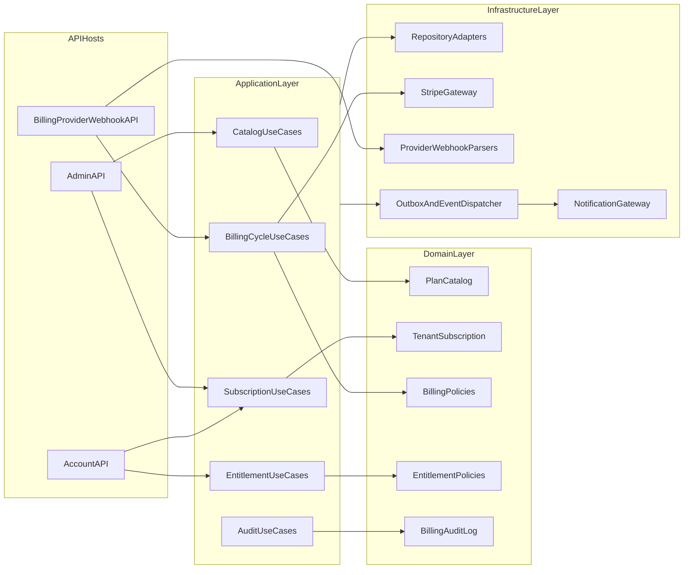
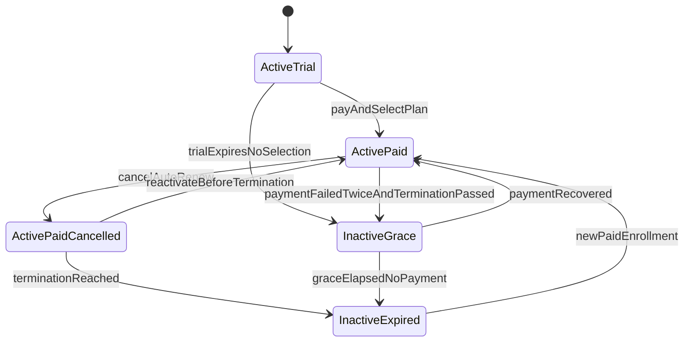

# Backend Billing Redesign Draft

Version: 1.1  
Audience: Backend, Frontend, Product  
Status: Proposed design draft for review

## 1. Scope and Decisions

This document defines the backend redesign for plans, subscriptions, and billing based on the requirements in `docs/shared/Requirements/Plans and Subscriptions/plans-requirements.md`.

Hard decisions for this redesign:
- App-driven lifecycle is the source of truth for subscription state.
- Payment providers execute charges and send events, but provider state does not replace domain state.
- Provider webhooks are hosted by billing service provider endpoints, not in account API.
- Clean rewrite is preferred over legacy adaptation where model mismatch exists.
- No backward compatibility constraints for old subscription/billing endpoints.
- This design exposes internal backend APIs for account and admin clients; external partner APIs and reporting dashboards remain out of scope for this phase.
- Trial subscriptions are first-class subscriptions, but trial plans are non-renewing and cannot accept user-purchased extensions.
- Price changes are implemented through effective-dated price versions with mandatory notice enforcement before a higher price can become active.
- Billing notifications reuse the existing email and in-app notification center pipeline; billing redesign adds event types and preference categories, not a separate notification subsystem.

## 2. Architecture Overview



## 3. Canonical API Contract

Base URL shape:
- Account API: `{accountBaseUrl}/api/v1`
- Admin API: `{adminBaseUrl}/api/v1`
- Billing webhook API: `{billingBaseUrl}` (provider endpoints)

Shared conventions:
- JSON camelCase.
- Response envelope: `ApiResponse<T>`.
- Time values in UTC ISO-8601.
- Owner endpoints require tenant owner authorization.
- Admin endpoints require admin policy authorization.
- Mutating endpoints require `Idempotency-Key` for retry-safe execution.
- Catalog mutations are effective-dated where a change can affect future billing or compliance-sensitive messaging.
- Billing-related notification preference management remains in the existing notification settings surface; this billing contract only defines emitted event families and category additions.

### 3.1 Owner Billing Endpoints (Account API)

#### GET `/billing/subscription/summary`
- Purpose: Return lightweight current-plan summary for shared authenticated tenant UI such as navigation/header badges.
- Auth: Any authenticated tenant user.
- Response shape (data):
  - `tenantId`, `planId`, `planName`, `planDisplayName`
  - `accessState` (`full`, `fallback`, `blocked`)
  - `isTrial`

#### GET `/billing/subscription/current`
- Purpose: Return active subscription, lifecycle flags, next billing action, and selected schedule.
- Auth: Tenant owner only.
- Response shape (data):
  - `tenantId`, `subscriptionId`, `plan`, `status`, `isTrial`, `autoRenew`
  - `effectiveDate`, `terminationDate`, `inGracePeriod`, `gracePeriodEndDate`
  - `paymentSchedule`, `activeExtensions[]`, `nextChargePreview`
  - `accessState` (`full`, `fallback`, `blocked`)
  - `pendingChangeSummary` (nullable)
  - `trialUpgradeBanner` (`show`, `message`, `expiresAtUtc`) for the 7-day trial reminder window

#### GET `/billing/plans/catalog`
- Purpose: Return published plans, schedules, extensions, and pricing overlays applicable to tenant.
- Auth: Any authenticated tenant user (read-only); non-owner still cannot mutate billing.
- Query:
  - `includeCurrentPlan=true|false`
  - `schedule=<scheduleCode>`
- Response:
  - `plans[]` with `featureSummary`, `limitsSummary`, `availableSchedules[]`, `availableExtensions[]`
  - trial plan is flagged and returned as non-upgradable for extension purchase
  - prices resolved through price-tier/discount preview rules without hiding base price provenance

#### POST `/billing/subscription/preview-change`
- Purpose: Dry-run plan/schedule/extension change with downgrade validation and cost summary.
- Auth: Tenant owner only.
- Request:
  - `targetPlanId`, `targetScheduleId`, `extensionSelections[]`, `discountCode`
- Response:
  - `effectiveMode` (`immediate` or `nextCycle`)
  - `lineItems[]` (charges, credits, extension deltas)
  - `totalDueNow`
  - `downgradeWarnings[]` with typed items containing `featureKey`, `featureName`, `currentUsage`, `newLimit`, `overageAmount`, `severity`, `blocked`, `recommendedAction`, `recommendedActionTarget`
  - `blockingViolations[]` with the same typed downgrade-impact contract
  - `discountApplication` (`none`, `tenantPriceTier`, `discountCode`, `discountCodeRejected`)
  - `effectivePriceTierId` (nullable)
  - `scheduledStartDateUtc`
  - `validationSnapshotId` (for confirm replay safety)
- Contract rule: all priced user-facing plan and extension mutations must use preview then confirm; frontend should not bypass preview for extension-only changes.

#### POST `/billing/subscription/confirm-change`
- Purpose: Execute change from a preview snapshot with payment authorization.
- Auth: Tenant owner only.
- Request:
  - `validationSnapshotId`, `paymentMethodToken`, `confirmationToken`
- Response:
  - `subscription`
  - `paymentResult` (`succeeded`, `requiresAction`, `failed`) with typed continuation payload for `requiresAction`: `nextActionType`, `clientSecret`, `paymentIntentId`, `redirectUrl`, `expiresAtUtc`
  - `receiptId` (if charged)

#### POST `/billing/subscription/cancel`
- Purpose: Disable auto-renew; subscription stays active until termination.
- Auth: Tenant owner only.
- Request:
  - `reason` (optional)
- Response:
  - updated subscription state (`autoRenew=false`)

#### POST `/billing/subscription/reactivate`
- Purpose: Re-enable auto-renew before termination date or recover during grace (if payment succeeds).
- Auth: Tenant owner only.
- Request:
  - `paymentMethodToken` (optional unless needed for immediate payment)
- Response:
  - updated subscription state

#### GET `/billing/subscription/extensions`
- Purpose: Return active extension selections and available extension catalog for current plan.
- Auth: Tenant owner only.
- Response:
  - `activeExtensions[]` with typed selection details (`extensionSelectionId`, `extensionDefinitionId`, `name`, `featureKey`, `quantity`, `unitValue`, `unitLabel`, `schedulePrice`, `totalPrice`)
  - `availableExtensions[]`

#### POST `/billing/subscription/extensions`
- Purpose: Internal or non-UI convenience mutation for extension quantity updates.
- Auth: Tenant owner only.
- Contract note: frontend flows must not call this endpoint directly for priced changes; extension-only updates are previewed via `POST /billing/subscription/preview-change` using the current plan/schedule plus updated `extensionSelections[]`, then committed through `POST /billing/subscription/confirm-change`.
- Request:
  - `extensionSelections[]` (`extensionDefinitionId`, `quantity`)
- Response:
  - updated extension state, `totalDueNow`, optional `receiptId`

#### DELETE `/billing/subscription/extensions/{extensionSelectionId}`
- Purpose: Remove extension selection effective next billing cycle (no refund).
- Auth: Tenant owner only.
- Response:
  - `effectiveRemovalDate`

#### GET `/billing/payment-method`
- Purpose: Return masked method details and expiration status.
- Auth: Tenant owner only.
- Response:
  - `brand`, `last4`, `expMonth`, `expYear`, `isExpiringSoon`

#### POST `/billing/payment-method/setup-intent`
- Purpose: Create provider setup session/token for safe card update.
- Auth: Tenant owner only.
- Response:
  - provider-specific setup client token

#### POST `/billing/payment-method/confirm`
- Purpose: Confirm and attach payment method to tenant billing profile.
- Auth: Tenant owner only.
- Request:
  - provider confirmation payload/token
- Response:
  - updated masked method

#### GET `/billing/payment-history`
- Purpose: Return payment list for subscription.
- Auth: Tenant owner only.
- Query:
  - `page`, `limit`, `from`, `to`
- Response:
  - `items[]` with payment date, amount, period covered, method last4, status

#### GET `/billing/payment-history/{paymentId}`
- Purpose: Return payment drill-in details for the payment history row detail view.
- Auth: Tenant owner only.
- Response:
  - `paymentId`, `paidAtUtc`, `status`, `providerStatus`, `providerFailureReason`
  - `amount`, `planName`, `billingPeriod`, `lineItems[]`
  - `cardSnapshot` (`brand`, `last4`, optional expiration snapshot)
  - `invoiceReference`, `receiptReference`, `providerReference`
  - `retryContext` (`attemptCount`, `maxAutomaticAttemptsPerCycle`, `nextRetryAtUtc`)

#### GET `/billing/payment-history/{paymentId}/receipt`
- Purpose: Return receipt metadata and downloadable file URL.
- Auth: Tenant owner only.
- Response:
  - `receiptId`, `downloadUrl`, `expiresAtUtc`
  - `lineItems[]`, `planName`, `billingPeriod`, `cardLast4`

#### GET `/billing/audit`
- Purpose: Return tenant-visible billing and subscription audit history for the current tenant.
- Auth: Tenant owner only.
- Query:
  - `page`, `limit`, `from`, `to`, `eventType`
- Response:
  - `items[]` containing the immutable audit schema defined in section 7.3, filtered to tenant-visible events only

#### GET `/billing/entitlements/effective`
- Purpose: Return effective features/limits after plan + extensions + overrides.
- Auth: Authenticated tenant user.

### 3.2 Admin Billing Endpoints (Admin API)

#### Canonical feature metadata
- `GET /admin/billing/feature-catalog`

#### Feature sets
- `GET /admin/billing/feature-sets`
- `GET /admin/billing/feature-sets/{featureSetId}`
- `POST /admin/billing/feature-sets`
- `PATCH /admin/billing/feature-sets/{featureSetId}`
- `DELETE /admin/billing/feature-sets/{featureSetId}`
- `POST /admin/billing/feature-sets/{featureSetId}/deactivate`
- `POST /admin/billing/feature-sets/{featureSetId}/activate`

#### Plans
- `GET /admin/billing/plans`
- `GET /admin/billing/plans/{planId}`
- `POST /admin/billing/plans`
- `PATCH /admin/billing/plans/{planId}`
- `DELETE /admin/billing/plans/{planId}`
- `POST /admin/billing/plans/{planId}/archive`
- `POST /admin/billing/plans/{planId}/restore`
- `PUT /admin/billing/plans/{planId}/schedules/{scheduleId}/price`
- `POST /admin/billing/plans/{planId}/publish`
- `POST /admin/billing/plans/{planId}/hide`
- `POST /admin/billing/plans/{planId}/set-trial`
- `DELETE /admin/billing/plans/trial-designation`
- `POST /admin/billing/plans/{planId}/set-fallback`
- `DELETE /admin/billing/plans/fallback-designation`

#### Payment schedules
- `GET /admin/billing/payment-schedules`
- `GET /admin/billing/payment-schedules/{scheduleId}`
- `POST /admin/billing/payment-schedules`
- `PATCH /admin/billing/payment-schedules/{scheduleId}`
- `DELETE /admin/billing/payment-schedules/{scheduleId}`
- `POST /admin/billing/payment-schedules/{scheduleId}/deactivate`
- `POST /admin/billing/payment-schedules/{scheduleId}/activate`

#### Extensions
- `GET /admin/billing/extensions`
- `GET /admin/billing/extensions/{extensionDefinitionId}`
- `POST /admin/billing/extensions`
- `PATCH /admin/billing/extensions/{extensionDefinitionId}`
- `DELETE /admin/billing/extensions/{extensionDefinitionId}`
- `POST /admin/billing/extensions/{extensionDefinitionId}/deactivate`
- `POST /admin/billing/extensions/{extensionDefinitionId}/activate`
- `PUT /admin/billing/extensions/{extensionDefinitionId}/plans/{planId}/schedules/{scheduleId}/price`

#### Price tiers and discount codes
- `GET /admin/billing/price-tiers`
- `GET /admin/billing/price-tiers/{priceTierId}`
- `POST /admin/billing/price-tiers`
- `PATCH /admin/billing/price-tiers/{priceTierId}`
- `DELETE /admin/billing/price-tiers/{priceTierId}`
- `POST /admin/billing/price-tiers/{priceTierId}/deactivate`
- `POST /admin/billing/price-tiers/{priceTierId}/activate`
- `PUT /admin/billing/tenants/{tenantId}/price-tier-assignment`
- `GET /admin/billing/tenants/{tenantId}/price-tier-assignment`
- `DELETE /admin/billing/tenants/{tenantId}/price-tier-assignment`
- `GET /admin/billing/discount-codes`
- `GET /admin/billing/discount-codes/{discountCodeId}`
- `POST /admin/billing/discount-codes`
- `PATCH /admin/billing/discount-codes/{discountCodeId}`
- `DELETE /admin/billing/discount-codes/{discountCodeId}`
- `POST /admin/billing/discount-codes/{discountCodeId}/deactivate`
- `POST /admin/billing/discount-codes/{discountCodeId}/activate`

#### Tenant overrides and audit
- `POST /admin/billing/tenants/{tenantId}/hidden-plan-assignment`
- `GET /admin/billing/tenants/{tenantId}/overrides`
- `POST /admin/billing/tenants/{tenantId}/overrides`
- `GET /admin/billing/tenants/{tenantId}/overrides/{overrideId}`
- `PATCH /admin/billing/tenants/{tenantId}/overrides/{overrideId}`
- `POST /admin/billing/tenants/{tenantId}/overrides/{overrideId}/end`
- `DELETE /admin/billing/tenants/{tenantId}/overrides/{overrideId}`
- `GET /admin/billing/tenants/{tenantId}/audit`
- `GET /admin/billing/audit`

Admin endpoint expectations:
- Feature metadata is exposed through a canonical feature catalog endpoint so admin clients can drive dropdowns, tier-option pickers, additive-only messaging, and server-aligned validation without hardcoding feature semantics.
- Every admin-managed catalog resource supports collection list/create plus item read/update and explicit lifecycle controls where hard delete is unsafe.
- Trial and fallback designation controls must enforce the single-designated-plan invariant and expose both set and unset operations.
- Hidden plans remain excluded from self-service catalog responses but can still be assigned through an explicit admin-only mutation that requires a support/commercial reason and produces a first-class audit record.
- Override management supports create, list, read, update, scheduled end, and removal semantics so support/admin operations do not depend on direct datastore edits.
- Admin list endpoints support filtering by status and archived state; audit endpoints support date and event filtering.

#### Billing settings
- `GET /admin/billing/settings`
- `PATCH /admin/billing/settings`
- Fields:
  - `retryDelayDays` (default 3)
  - `maxAutomaticAttemptsPerCycle` (default 2, configurable, minimum 1)
  - `cardExpiryWarningDays` (default 30, minimum 1)
  - `priceChangeNoticeMinimumDays` (default 30, minimum 30)
  - `annualRenewalReminderLeadWindowDays` (default range 30-45, minimum start 30)
  - notification policy toggles required by legal/compliance

### 3.3 Provider Webhook Endpoints (Billing Service)

- `POST /billing/providers/stripe/webhooks`
- Reserved path pattern for future providers: `POST /billing/providers/{provider}/webhooks`

Rules:
- No account API webhook endpoints.
- Signature verification is provider-specific and mandatory.
- Webhook handlers are idempotent by provider event id.
- Webhook handlers append domain audit records and trigger internal commands only.

### 3.4 Error Contract

Standard error payload:
- `code` (stable machine code)
- `message` (human-readable)
- `details` (field errors or business diagnostics)
- `correlationId`

HTTP semantics:
- `409 Conflict` is returned when the request collides with current domain state or an effective-dated uniqueness rule, such as existing trial/fallback designation, overlapping effective periods, or idempotency-key payload mismatch.
- `422 Unprocessable Entity` is returned when the request is well-formed but violates billing validation rules, such as non-additive overrides, invalid feature value shape, hidden-plan assignment without an admin reason, or assigning a hidden-plan endpoint to a published plan.
- Both `409` and `422` continue to use the same `ApiResponse<T>` envelope; diagnostics are carried in `error.details`.
- `error.details.conflicts[]` is the canonical structure for `409` responses.
- `error.details.validationErrors[]` is the canonical structure for `422` responses.

Billing-specific codes:
- `BILLING_OWNER_REQUIRED`
- `BILLING_PLAN_CHANGE_BLOCKED`
- `BILLING_PAYMENT_METHOD_REQUIRED`
- `BILLING_PAYMENT_FAILED`
- `BILLING_IDEMPOTENCY_CONFLICT`
- `BILLING_WEBHOOK_SIGNATURE_INVALID`
- `BILLING_WEBHOOK_EVENT_DUPLICATE`
- `BILLING_DISCOUNT_INELIGIBLE`
- `BILLING_PRICE_TIER_CONFLICT`
- `BILLING_TRIAL_EXTENSION_NOT_ALLOWED`
- `BILLING_PRICE_CHANGE_NOTICE_REQUIRED`
- `BILLING_DISCOUNT_COMBINATION_BLOCKED`
- `BILLING_ACCESS_BLOCKED`
- `BILLING_PLAN_DESIGNATION_CONFLICT`
- `BILLING_EFFECTIVE_DATE_OVERLAP`
- `BILLING_VALIDATION_FAILED`
- `BILLING_OVERRIDE_NOT_ADDITIVE`

## 4. Domain Contexts, Aggregates, Invariants

### 4.1 Contexts

- Catalog context:
  - `FeatureSet`, `Plan`, `PaymentSchedule`, `PlanPrice`, `ExtensionDefinition`, `ExtensionPrice`, `PriceTier`, `DiscountCode`, `PriceTierAssignment`.
- Subscription context:
  - `TenantSubscription`, `SubscriptionExtensionSelection`, `SubscriptionOverride`, `PendingSubscriptionChange`, `AppliedDiscount`.
- Billing context:
  - `BillingTransaction`, `InvoiceSnapshot`, `PaymentMethodSnapshot`, `ProviderCustomerLink`, `ProviderSubscriptionLink`.
- Audit context:
  - immutable `BillingAuditRecord`.

### 4.2 Core invariants

- Exactly one tenant owner per tenant.
- At most one active subscription per tenant for any time interval.
- Only one trial plan and one fallback plan can be designated globally at a time.
- Overrides are additive only; never reduce a base capability.
- Trial plan pricing is zero-priced, non-renewing, and rejects user-selected extension purchases.
- Prices must resolve deterministically: discount code or tenant tier overlay, then base fallback.
- Tenant price-tier assignment and discount-code application cannot create ambiguous stacked pricing; the pricing engine must choose one effective tier per billable line item.
- State transitions must be valid against lifecycle rules (no ad-hoc status jumps).
- Cancellation-at-term-end bypasses grace and transitions directly to fallback or blocked access.
- Billing cycle calculations always use UTC.
- Audit records are append-only and retained indefinitely in this phase.

### 4.3 Policy services

- `ProrationPolicyService`
- `DowngradeValidationPolicyService`
- `EntitlementResolutionPolicyService`
- `GraceAndFallbackPolicyService`
- `RetrySchedulingPolicyService`
- `DiscountEligibilityPolicyService`
- `PriceSelectionPolicyService`
- `NotificationCompliancePolicyService`
- `AccessRestrictionPolicyService`

### 4.4 Aggregate command and event boundaries

`PlanCatalog` aggregate commands:
- `CreateFeatureSet`
- `UpdateFeatureSet`
- `CreatePlan`
- `PublishPlan`
- `SetTrialPlan`
- `SetFallbackPlan`
- `DefineSchedulePrice`
- `DefineExtensionPrice`
- `CreatePriceTier`
- `CreateDiscountCode`
- `AssignTenantPriceTier`
- `SchedulePriceChange`

`PlanCatalog` domain events:
- `FeatureSetCreated`
- `PlanPublished`
- `TrialPlanDesignated`
- `FallbackPlanDesignated`
- `PriceTierDefined`
- `DiscountCodeActivated`
- `TenantPriceTierAssigned`
- `FuturePriceChangeScheduled`

`TenantSubscription` aggregate commands:
- `AssignTrialSubscription`
- `PreviewPlanChange`
- `ConfirmPlanChange`
- `CancelAutoRenew`
- `ReactivateAutoRenew`
- `ApplyExtensionSelection`
- `RemoveExtensionSelection`
- `ApplyDiscountCode`
- `EnterGracePeriod`
- `ApplyFallbackPlan`
- `RecoverFromGrace`
- `BlockTenantAccess`

`TenantSubscription` domain events:
- `SubscriptionActivated`
- `SubscriptionRenewed`
- `SubscriptionPlanChanged`
- `SubscriptionCancelled`
- `SubscriptionReactivated`
- `SubscriptionChangeScheduled`
- `DiscountCodeAppliedToSubscription`
- `SubscriptionEnteredGrace`
- `SubscriptionRecoveredFromGrace`
- `SubscriptionFallbackApplied`
- `SubscriptionAccessBlocked`

`BillingAuditLog` aggregate commands:
- `AppendAuditRecord`

`BillingAuditLog` domain events:
- `AuditRecordAppended`

## 5. Billing Lifecycle and Orchestration

### 5.1 State machine



Transition semantics that resolve requirement ambiguities:
- Trial expiry moves the tenant to `InactiveGrace`; the grace clock uses the trial plan's grace period.
- Auto-renew cancellation keeps the subscription active through the paid-through date, then transitions directly to fallback or blocked access with no grace period.
- Payment failure only enters grace for billable subscriptions that were expected to auto-renew and reached termination without a successful renewal charge.
- Applying a fallback plan closes the prior paid subscription interval and creates a new non-billable fallback subscription record so entitlement history stays explicit and intervals do not overlap.

### 5.2 Orchestrated jobs

- Month-start billing run (UTC day 1):
  - select due subscriptions for current date by schedule.
  - attempt charge for plan + active extensions.
  - persist transaction and append audit event.
  - emit notifications.
- Retry run:
  - execute first-failure retries after configurable delay.
  - max two automatic attempts per cycle.
- Grace transition run:
  - move to grace when eligibility rules match.
  - apply fallback or block access after grace end.
- Expiration warning jobs:
  - trial expiration notifications (7d and 1d).
  - schedule expiration reminders.
  - payment method expiration warning (14d).
- Legal/compliance notification jobs:
  - annual renewal reminders 15-45 days before annual renewal.
  - price change notices at least 7 days before a higher effective price activates.
  - cancellation confirmations, enrollment confirmations, and plan change confirmations emitted immediately from domain events.

Deterministic due-subscription selector:
- A subscription is due in month `M` when:
  - `autoRenew=true`
  - status is billable (`activePaid` or `inactiveGrace` recovery candidate)
  - `monthsBetween(anchorMonth, M) % scheduleMonths == 0`
- `anchorMonth` is the first full billing month after paid enrollment.
- First enrollment proration always covers enrollment date through month end in UTC.

Retry and grace timeline policy:
- Attempt 1 at due timestamp.
- Attempt 2 at `attempt1 + retryDelayDays`.
- If attempt 2 fails:
  - when `now >= terminationDateUtc`, transition to `inactiveGrace`.
  - compute `gracePeriodEndDate = terminationDateUtc + graceDays`.
- At grace end:
  - fallback plan exists: apply fallback subscription immediately.
  - fallback missing: mark tenant as access blocked and emit critical notification.

Price-version activation policy:
- Base plan prices, extension prices, and price-tier prices are stored as effective-dated versions.
- A price increase cannot become active unless a compliant notice has been scheduled and emitted at least `priceChangeNoticeMinimumDays` before the effective date.
- Existing preview and renewal calculations resolve prices based on the target transaction date, not the request date.

### 5.3 Proration and change logic

- Upgrade:
  - immediate plan switch.
  - charge delta now (`new prorated charge - current credit`).
- Downgrade:
  - schedule next-cycle activation.
  - no immediate charge/refund.
- Schedule-only change:
  - effective next cycle.
- Extension add:
  - immediate prorated charge.
- Extension remove:
  - effective next cycle, no refund.
- Trial-to-paid conversion:
  - treated as a first-time paid enrollment with immediate proration through month end.
- Discount application:
  - price selection runs before proration; proration always uses the resolved effective price.

Proration formula:
- `proratedAmount = fullPeriodPrice * (remainingDaysInCycle / totalDaysInCycle)`
- `deltaDueNow = max(0, proratedTarget + proratedExtensions - proratedCreditCurrent)`
- Downgrade where `proratedCreditCurrent > proratedTarget` never creates refund; credit is consumed by deferred effective date.

Price selection policy:
- Resolve applicable tenant price-tier assignment for the tenant and transaction date.
- Evaluate discount code eligibility for the requested line items, schedule, tenant, and renewal/new-purchase context.
- If an eligible discount code yields a price tier, that tier replaces tenant-tier pricing for the affected line items only.
- If a resolved tier does not define a price for a line item, fall back to the base plan or extension price.
- Supported adjustment modes are percent discount, fixed amount discount, and override price.
- Combination rules are explicit on the discount definition. When an active applied discount blocks additional discounts, preview must reject incompatible combinations with `BILLING_DISCOUNT_COMBINATION_BLOCKED`.

### 5.4 Downgrade enforcement outcomes

- If `activeUsers > maxUsers` then block plan change.
- If `activeUsers > includedUsers` and `activeUsers <= maxUsers`, warn about required additional-user pricing; if no qualifying extension exists on the target plan, block the downgrade.
- If capacity features exceed target limits then warn and allow with deterministic disable policy:
  - keep first N by creation date.
  - disable remainder without deletion.
- Boolean/tier features change at effective date.
- Token consumables do not retrocharge; new cap enforced until next reset.

Warning payload requirements:
- Preview responses must identify each exceeded feature, current usage, target limit, whether the result is `warning` or `blocking`, and the post-effective-date consequence.
- The deterministic disable list must be reproducible from a stable ordering key so UI preview and background execution produce the same disabled set.

### 5.5 Notifications and legal-compliance orchestration

Delivery rules:
- Every billing/subscription notification is delivered by email to the tenant owner and published into the existing in-app notification center.
- Existing notification preferences infrastructure is extended with billing categories; mandatory categories cannot be opted out of.

Required notification event families:
- Enrollment confirmation, cancellation confirmation, and plan change confirmation.
- Trial expiration warning, subscription expiration reminder, annual renewal reminder, and price change notice.
- Payment success receipt, payment failure, grace period started, grace period ending, fallback applied, access blocked, and payment method expiring.

Compliance rules:
- Enrollment confirmation and plan change confirmation must include price, billing frequency, renewal terms, and cancellation instructions.
- Annual renewal reminders must be sent 15-45 days before annual renewals.
- Price change notices must be sent at least 7 days before the higher price takes effect.
- Cancellation must remain online and owner-accessible without contacting support; the backend must therefore preserve a single-step `cancel` mutation and emit a durable confirmation event.

Preference categories added to notification settings:
- `enrollmentAndCancellationConfirmations` (mandatory)
- `renewalReminders` (mandatory)
- `trialExpirationWarnings` (mandatory)
- `priceChangeNotices` (mandatory)
- `paymentSuccessReceipts` (optional)
- `paymentFailureAlerts` (mandatory)
- `gracePeriodAlerts` (mandatory)
- `paymentMethodExpiration` (optional)
- `planChangeConfirmations` (mandatory)

### 5.6 Payment method, receipts, disputes, and provider-initiated changes

- The platform stores only masked payment-method metadata and provider references; raw card numbers never enter domain storage.
- Stripe automatic card updates are accepted and projected into `PaymentMethodSnapshot`, with tenant-owner notification only when the effective card details visible to the user change.
- Charge disputes and chargebacks create immutable audit records and a high-priority admin notification; they do not automatically suspend access in this phase.
- Receipts and invoices are the same document. Receipt snapshots must preserve plan name, billing period, line items, amount, and card last4 even if catalog pricing changes later.

## 6. Provider Layer and Stripe Boundaries

### 6.1 Provider-neutral interfaces

Define provider-neutral contracts in domain/application:
- `IBillingProviderGateway`
- `IBillingWebhookVerifier`
- `IBillingWebhookTranslator`
- `IBillingPaymentMethodGateway`
- `IBillingReceiptGateway`

Provider-specific objects must stay in infrastructure.

Recommended interface surface (conceptual C#):

```csharp
public interface IBillingProviderGateway
{
    Task<ProviderChargeResult> ChargeAsync(ProviderChargeCommand command, CancellationToken ct);
    Task<ProviderSetupIntentResult> CreateSetupIntentAsync(ProviderSetupIntentCommand command, CancellationToken ct);
    Task<ProviderSubscriptionReference> EnsureCustomerAndSubscriptionAsync(ProviderSubscriptionCommand command, CancellationToken ct);
    Task<ProviderReceiptResult> GetReceiptAsync(ProviderReceiptQuery query, CancellationToken ct);
}

public interface IBillingWebhookVerifier
{
    Task<WebhookVerificationResult> VerifyAsync(string provider, IDictionary<string, string> headers, string rawBody, CancellationToken ct);
}

public interface IBillingWebhookTranslator
{
    Task<ProviderEventEnvelope> TranslateAsync(string provider, string rawBody, CancellationToken ct);
}
```

### 6.2 Stripe adapter responsibilities

- Convert internal billing commands to Stripe API calls.
- Verify Stripe signature for Stripe endpoint only.
- Translate Stripe events into internal `ProviderEvent` commands.
- Never expose Stripe SDK types outside infrastructure layer.

Stripe event normalization map:
- `invoice.payment_succeeded` -> `PaymentCaptured`
- `invoice.payment_failed` -> `PaymentFailed`
- `customer.subscription.updated` -> `ProviderSubscriptionStateChanged`
- `customer.subscription.deleted` -> `ProviderSubscriptionCancelled`
- `charge.dispute.created` -> `PaymentDisputeOpened`
- `customer.source.updated` or equivalent card-update events -> `PaymentMethodUpdatedByProvider`
- payment method update events -> `PaymentMethodUpdatedByProvider`

### 6.3 Webhook processing pipeline

1. Receive provider webhook on provider endpoint.
2. Verify signature.
3. Compute idempotency key (`provider + eventId`).
4. Store receipt if not processed.
5. Translate provider payload to internal event.
6. Dispatch application command.
7. Persist resulting domain updates + audit.
8. Mark processed.

## 7. Data, Idempotency, Audit, Reconciliation

### 7.1 Persistence model (Dynamo-oriented conceptual tables)

- `BillingPlanCatalog`
- `BillingSubscription`
- `BillingSubscriptionScheduleChanges`
- `BillingExtensionSelections`
- `BillingOverrides`
- `BillingDiscountCodes`
- `BillingPriceTiers`
- `BillingPriceTierAssignments`
- `BillingAppliedDiscounts`
- `BillingTransactions`
- `BillingReceipts`
- `BillingPaymentMethods`
- `BillingProviderLinks`
- `BillingProcessedProviderEvents`
- `BillingAuditLog`
- `BillingOutbox`

Recommended key design:

| Table | Partition Key | Sort Key | Purpose |
| --- | --- | --- | --- |
| BillingPlanCatalog | `CATALOG#<entityType>` | `<entityId>#<version>` | Immutable or versioned catalog entities |
| BillingSubscription | `TENANT#<tenantId>` | `SUB#<subscriptionId>` | Subscription aggregate snapshots |
| BillingAppliedDiscounts | `TENANT#<tenantId>` | `DISC#<appliedDiscountId>` | Active and historical discount applications with repeatability windows |
| BillingTransactions | `TENANT#<tenantId>` | `TXN#<timestampUtc>#<transactionId>` | Payment attempts and outcomes |
| BillingPaymentMethods | `TENANT#<tenantId>` | `PM#<paymentMethodId>` | Masked method metadata only |
| BillingProviderLinks | `TENANT#<tenantId>` | `PROVIDER#<provider>#<linkType>` | Customer/subscription external references |
| BillingProcessedProviderEvents | `PROVIDER#<provider>` | `EVENT#<eventId>` | Webhook idempotency and replay barrier |
| BillingAuditLog | `TENANT#<tenantId>` | `AUDIT#<timestampUtc>#<auditId>` | Immutable event trail |
| BillingOutbox | `STREAM#billing` | `OUTBOX#<timestampUtc>#<eventId>` | Asynchronous event dispatch queue |

Suggested GSIs:
- `GSI1` on `BillingSubscription` for status scans by due month.
- `GSI2` on `BillingTransactions` for provider reference lookup.
- `GSI3` on `BillingAuditLog` for event type and date filtering.
- `GSI4` on `BillingAppliedDiscounts` for active-discount lookup by tenant and effective date.

### 7.2 Idempotency model

- API mutations:
  - key: `tenantId + endpoint + idempotencyKey`.
  - store request hash + response hash + TTL.
  - reject key reuse on payload mismatch.
- Webhooks:
  - key: `provider + providerEventId`.
  - exact-once command execution semantics by processed-event record.
- Jobs:
  - key: `jobType + period + tenantId` execution ledger.

Conflict behavior:
- Same key + same payload hash -> return cached success response.
- Same key + different payload hash -> return `409 BILLING_IDEMPOTENCY_CONFLICT`.
- Expired key beyond TTL -> treat as new request.

### 7.3 Audit schema

Fields:
- `id`, `timestampUtc`, `tenantId`
- `actorType` (`tenant_owner`, `admin`, `system`)
- `actorId`
- `eventType`
- `description`
- `beforeState`, `afterState`
- `metadata` (provider ids, failure reasons, proration details, correlation id)

Access and retention:
- Tenant owners can query only their tenant's billing/subscription audit stream.
- Admins can query any tenant's audit stream.
- Retention is indefinite for this phase; archival policy is deferred.

### 7.4 Reconciliation jobs

- Provider reconciliation:
  - compare provider transactions/subscriptions to internal transactions/subscriptions.
  - produce discrepancy report and corrective commands.
- Stuck status reconciliation:
  - detect subscriptions with inconsistent lifecycle flags and repair via deterministic rule engine.

Operational thresholds:
- Critical alert: any reconciliation mismatch that changes access state.
- Warning alert: monetary mismatch under configured threshold.
- Daily reconciliation summary report persisted for auditability.

## 8. Test Strategy

### 8.1 Test layers

- Domain tests:
  - invariants, lifecycle transitions, proration math, downgrade rules.
- Application tests:
  - use-case orchestration, idempotency rules, event handling.
- Infrastructure tests:
  - provider adapters, webhook verification/translation, repository mapping.
- Contract tests:
  - endpoint request/response schemas and error code stability.
- End-to-end tests:
  - owner workflows, admin catalog changes, webhook replay, retry/grace/fallback.

### 8.2 Mandatory scenario matrix

- Registration to trial subscription.
- Trial expiration without conversion.
- Trial upgrade banner eligibility in the 7-day window.
- Mid-cycle upgrade with immediate charge.
- Downgrade with over-limit warnings and deterministic disable.
- Downgrade blocked because included users are exceeded and no qualifying extension exists.
- Billing retry flow (first fail, second fail, grace).
- Recovery from grace with successful payment.
- Fallback plan application.
- Cancellation reaching paid-through date and going directly to fallback/block without grace.
- Cancel/reactivate before termination.
- Tenant price-tier assignment with missing tier price falling back to base price.
- Discount code eligibility for new subscription, renewal, referral, and tenant-specific restrictions.
- Discount code duration preventing a conflicting second discount while active.
- Payment method expiring notification.
- Stripe automatic card update webhook projection.
- Charge dispute webhook producing admin alert and audit record.
- Price change scheduling blocked when notice window is not satisfied.
- Duplicate webhook replay ignored idempotently.

### 8.3 Quality gates before cutover

- Contract gate:
  - 100 percent pass on endpoint schema contract tests for owner/admin endpoints.
- Domain gate:
  - 100 percent pass on lifecycle transition and proration policy tests.
- Reliability gate:
  - webhook idempotency replay tested for at least 10 duplicate deliveries per event type.
  - scheduled job re-run safety validated for same cycle window.
- Data gate:
  - reconciliation mismatch rate below agreed threshold for two consecutive dry-run cycles.

## 9. Legacy Component Deprecation and Replacement

### 9.1 Remove or retire

- Account webhook endpoint:
  - `Services/PurposePath.Account.Lambda/Controllers/BillingWebhookController.cs`
- Payment-confirmation-only path:
  - `PurposePath.Infrastructure/BillingProviders/StripePaymentConfirmationHandler.cs`
- Stripe-coupled domain contracts:
  - `PurposePath.Domain/Services/IStripeService.cs`
  - Stripe-named parts of `PurposePath.Domain/Services/IWebhookProcessingService.cs`
- Tier-centric assumptions that do not map to new catalog model:
  - `PurposePath.Domain/Entities/SubscriptionTier.cs` (replace with plan catalog model)

### 9.2 Replace with

- Billing-service provider webhook controllers/handlers only.
- Provider-neutral interfaces in domain/application.
- New catalog/subscription model aligned to feature sets, schedules, extensions, tiers, and discounts.
- Unified billing orchestration use cases and jobs.

### 9.3 Cutover phases and rollback

Phase A: Foundation deploy (dark mode)
- Deploy new domain/application/infrastructure paths disabled by feature flags.
- Keep legacy reads/writes active.

Phase B: Shadow execution
- Execute new billing calculations in parallel without side effects.
- Persist shadow outputs for comparison only.

Phase C: Controlled write cutover
- Enable new write paths for a pilot tenant cohort.
- Webhooks routed only to new billing-service provider endpoints.
- Legacy webhook path returns hard failure to prevent split processing.

Phase D: Full cutover
- Expand to all tenants.
- Disable legacy billing mutation endpoints.

Phase E: Decommission
- Remove retired components and cleanup config/secrets/routes.

Rollback policy:
- If critical severity access regression or monetary mismatch is detected:
  - disable new write feature flags immediately.
  - continue reads from last consistent snapshots.
  - replay failed operations from idempotent request/event logs after fix.

## 10. Implementation Epics and Issue Breakdown

### Epic 1: API and contract foundation
- Define request/response schemas for all owner/admin/provider endpoints.
- Implement auth and error contract enforcement.
- Add idempotency middleware for mutation endpoints.

### Epic 2: Catalog and pricing domain rewrite
- Build feature set/plan/schedule/extension aggregates.
- Implement price tiers and discount code rules.
- Build admin CRUD endpoints and validation.

### Epic 3: Subscription lifecycle engine
- Build subscription aggregate and state machine rules.
- Implement preview-confirm change workflow.
- Implement downgrade enforcement and entitlement resolution.

### Epic 4: Provider integration layer
- Implement provider-neutral interfaces.
- Implement Stripe adapter.
- Implement provider-specific webhook endpoint and translation pipeline.

### Epic 5: Billing orchestration and notifications
- Month-start billing runner, retries, grace/fallback.
- Notification events and channel delivery integration.
- Payment method expiration monitor.

### Epic 6: Audit, reconciliation, hardening
- Append-only audit implementation and queries.
- Reconciliation jobs.
- Observability and alerting for failed jobs/webhook anomalies.

### Epic 7: Test and cutover
- Build test matrix and automation.
- Run shadow verification on legacy data.
- Cutover and deprecate replaced legacy components.

## 11. Remaining Open Items

- Perpetual plan behavior: exact billing and lifecycle semantics when termination is null.
- Receipt storage policy: signed URL lifetime and whether immutable receipt binaries are stored inside platform-managed storage or delegated fully to the provider.
- Sales-tax handling: requirements keep this out of scope, but production launch still needs a go/no-go decision on Stripe Tax or equivalent.

