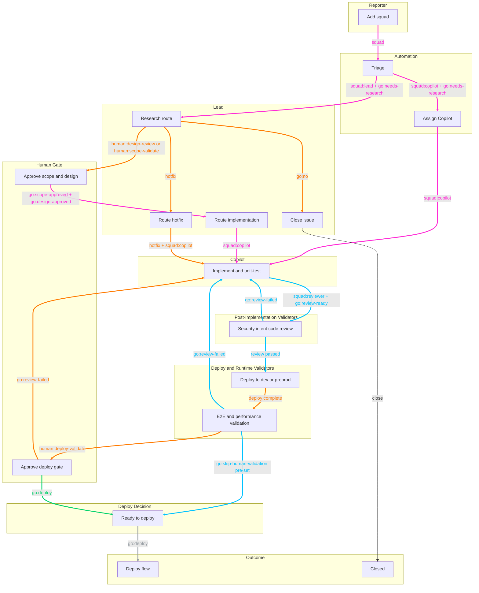
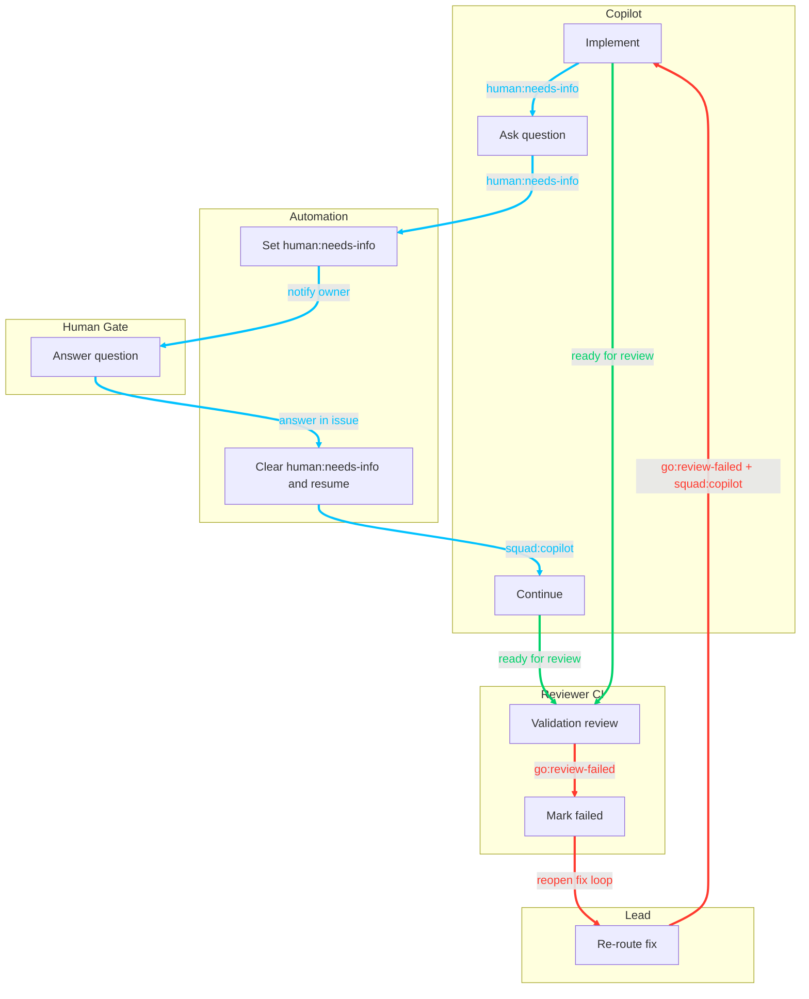

# Squad Label State Machine

## Purpose

This document is the single source of truth for issue workflow states driven by label namespaces in repositories running Squad, especially:
- `squad` and `squad:*`
- `go:*`

It also includes related operational states that directly affect coding-agent wait/resume flow.

## Scope

This state machine describes issue lifecycle behavior across the standard Squad files:
- `.github/workflows/squad-triage.yml`
- `.github/workflows/squad-issue-assign.yml`
- `.github/workflows/squad-label-enforce.yml`
- `.github/workflows/squad-heartbeat.yml`
- `.github/workflows/sync-squad-labels.yml`
- `.github/workflows/squad-copilot-qa-loop.yml`
- `.squad/agents/*.md`
- `.squad/routing.md`
- `.squad/team.md`

## Namespace Rules

- `go:*` labels are mutually exclusive (enforced automatically).
- `release:*` labels are mutually exclusive (enforced automatically).
- `type:*` labels are mutually exclusive (enforced automatically).
- `priority:*` labels are mutually exclusive (enforced automatically).
- `human:*` labels are explicit human-gate signals and are mutually exclusive (one open gate at a time).
- `squad` is inbox/triage entry; `squad:*` is assignment/routing.

## State Catalog

### Squad Namespace

| Label | Meaning | Set By | Trigger | What Must Happen In This State |
|---|---|---|---|---|
| `squad` | Issue enters squad triage inbox | Manual (user/automation) | Label added to issue | `squad-triage.yml` must evaluate assignment and add one `squad:*` label |
| `squad:lead` | Routed to lead for coordination/triage path | Automatic or manual | Triage selects lead path, or manual correction | Lead performs triage/design/hotfix coordination and decides next routing |
| `squad:reviewer` | Routed to reviewer | Automatic or manual | Routing/assignment decision | Reviewer handles review gates and can drive promote/fail outcomes |
| `squad:quality-reviewer` | Routed to quality reviewer | Automatic or manual | Quality/architecture gap path | Quality reviewer diagnoses and drives correction workflow |
| `squad:copilot` | Routed to coding agent | Automatic or manual | Triage/lead routes coding work to Copilot | `squad-issue-assign.yml` assigns coding agent and starts implementation |

### Go Namespace

| Label | Meaning | Set By | Trigger | What Must Happen In This State |
|---|---|---|---|---|
| `go:needs-research` | Default triage verdict: investigation required | Automatic by triage or manual by lead | Added by `squad-triage.yml` or lead research hold decision | Gather missing evidence, then transition to approved/design/hotfix/no path |
| `go:yes` | Approved to implement (legacy/governance path) | Manual | Explicit approval decision | Ensure release target exists; `squad-label-enforce.yml` auto-adds `release:backlog` if missing |
| `go:no` | Not pursuing implementation | Manual | Explicit reject/defer decision | Any `release:*` labels are removed automatically |
| `go:scope-approved` | Scope approved, proceed to design | Manual gate per team/lead process | @mottych scope confirmation | Advance to design and decomposition path |
| `go:design-approved` | Design approved, proceed to implementation sub-issues | Manual gate per team/lead process | @mottych design confirmation | Create/route implementation issues |
| `go:review-ready` | Implementation complete and ready for reviewer validation stage | Lead/implementor/manual | Code complete and local/unit validation done | Route to reviewer validation lane |
| `go:skip-human-validation` | Explicit approval to skip human deploy-validation gate | Manual gate per team/lead process | @mottych risk acceptance decision | Bypass `human:deploy-validate` and move to deploy decision |
| `go:deploy` | Deployment authorized to target environment (dev or prod) | Manual/role-driven gate | Validation complete and owner acknowledgement | Execute deployment/promotion workflow for target environment |
| `go:review-failed` | CI/review/deploy failed; needs correction | Manual/role-driven or automation-linked operations | Failure diagnostics/reopen flow | Reopen corrective work, fix issue, re-run validation |

### Hotfix Flag (Warning)

| Label | Meaning | Set By | Trigger | What Must Happen In This State |
|---|---|---|---|---|
| `hotfix` | Production fix warning flag | Automatic or manual | Existing prod/hotfix signals or explicit decision | Use hotfix workflow from production baseline (`master`) and validate on preprod before production |

### Related Operational Labels (Non-go/squad, but state-critical)

| Label | Meaning | Set By | Trigger | What Must Happen In This State |
|---|---|---|---|---|
| `human:needs-info` | Waiting for reporter/owner input | Manual or automatic | Clarification required, or Copilot question detected in `squad-copilot-qa-loop.yml` | Owner responds; Q&A loop removes label and resumes agent work |

### Human Namespace (Explicit Human Gates)

| Label | Meaning | Set By | Trigger | Auto-clear Condition |
|---|---|---|---|---|
| `human:needs-info` | Human response required before Copilot continues | Copilot Q&A automation/lead/manual | Copilot asks a clarifying question | Removed when owner responds in issue thread |
| `human:design-review` | Human design review is required | Lead/automation/manual | Design decision required | Removed when `go:design-approved` is applied |
| `human:scope-validate` | Human scope validation is required | Lead/automation/manual | Scope decision required | Removed when `go:scope-approved` is applied |
| `human:deploy-validate` | Human deployment validation gate is required | Lead/automation/manual | Validation evidence is ready in target environment (dev or preprod) | Removed when `go:deploy` or `go:skip-human-validation` is applied |

## Transition Map

## State Transition Diagram (STD)

Legend:
- `A:*` = Automation
- `L:*` = Lead
- `H:*` = Human gate
- `C:*` = Copilot
- `R:*` = Reviewer/CI
- `X:*` = Expert agents (optional)

### STD-1: Core Delivery Path (Compact)

### STD-2: Exception Loops (Compact)

### Primary Flow (Standard)

1. `squad` added
2. `squad-triage.yml` assigns `squad:*` and adds `go:needs-research`
3. Lead triage/research resolves unknowns
4. Transition to approval states (`go:scope-approved`, `go:design-approved`) based on scope
5. Route execution to `squad:copilot` or squad member
6. After implementation, run post-implementation validators (security, intent alignment, code review)
7. Deploy to validation environment (dev or preprod), then run E2E + performance checks
8. If `go:skip-human-validation` is pre-set, bypass human deploy gate; otherwise use `human:deploy-validate`
9. On successful decision -> `go:deploy`
10. On failure -> `go:review-failed` and correction loop

### Hotfix Flow

1. `squad` + prod/hotfix signals
2. `squad-triage.yml`/lead ensures `hotfix`
3. Lead hotfix triage and approval gate
4. Implement and validate hotfix path
5. Promote and backmerge per governance

### Copilot Q&A Wait/Resume Flow

1. Issue in `squad:copilot`
2. Copilot comment with question-like content
3. `squad-copilot-qa-loop.yml` adds `human:needs-info` and notifies owner
4. Owner replies in issue
5. `squad-copilot-qa-loop.yml` removes `human:needs-info` and re-assigns Copilot
6. Implementation resumes

## Additional Actors (Extensions)

### Expert Agents (security, performance, domain specialists)

- Pattern: add the member to `.squad/team.md`.
- Routing label: `squad:{member}` is created automatically by `sync-squad-labels.yml`.
- Integration point: Lead can route specific review/analysis steps to expert agents before returning work to implementation/review lanes.
- Typical examples:
  - `squad:security` for threat-model or permission boundary checks
  - `squad:performance` for load/perf profiling and optimization guidance

### Scribe

- Scribe is a background/documentation actor and normally does not gate label transitions.
- Scribe may record status and outcomes, but should not block implementation, validation, or promotion decisions.

### Human Gate Trigger Rule

- Any open `human:*` label means human intervention is required.
- Resolution model:
  - `human:needs-info` -> owner answer -> resume Copilot
  - `human:design-review` -> `go:design-approved`
  - `human:scope-validate` -> `go:scope-approved`
  - `human:deploy-validate` -> `go:deploy` (or `go:skip-human-validation`)

## Automatic vs Manual Responsibility Matrix

| Transition Type | Automatic | Manual |
|---|---|---|
| Initial squad triage | Yes (`squad-triage.yml`) | Optional override by lead/owner |
| Member assignment from `squad:*` | Yes (`squad-issue-assign.yml`) | Manual reassign by label swap |
| `go:*` exclusivity | Yes (`squad-label-enforce.yml`) | N/A |
| Research hold (`go:needs-research`) | Yes (default) / manual hold | Lead/owner resolves and transitions |
| Approval gates (`go:scope-approved`, `go:design-approved`) | No | Owner/lead workflow decision |
| Failure gate (`go:review-failed`) | Operational/manual per role flow | Reviewer/lead/CI monitor process |
| Copilot wait/resume (`human:needs-info` loop) | Yes (`squad-copilot-qa-loop.yml`) | Owner replies to resume |

## Maintenance Contract (Required)

This document must be updated in the same change whenever label-state behavior changes in any of these files:
- `.github/workflows/squad-*.yml`
- `.github/workflows/sync-squad-labels.yml`
- `.squad/**/*.md`

Canonical path for all repos: `docs/shared/process/SQUAD_LABEL_STATE_MACHINE.md`.

If behavior changes and this document is not updated, workflow policy should fail the change.

## Last Updated

- 2026-03-12
- Includes Copilot Q&A wait/resume automation state (`squad-copilot-qa-loop.yml`)
