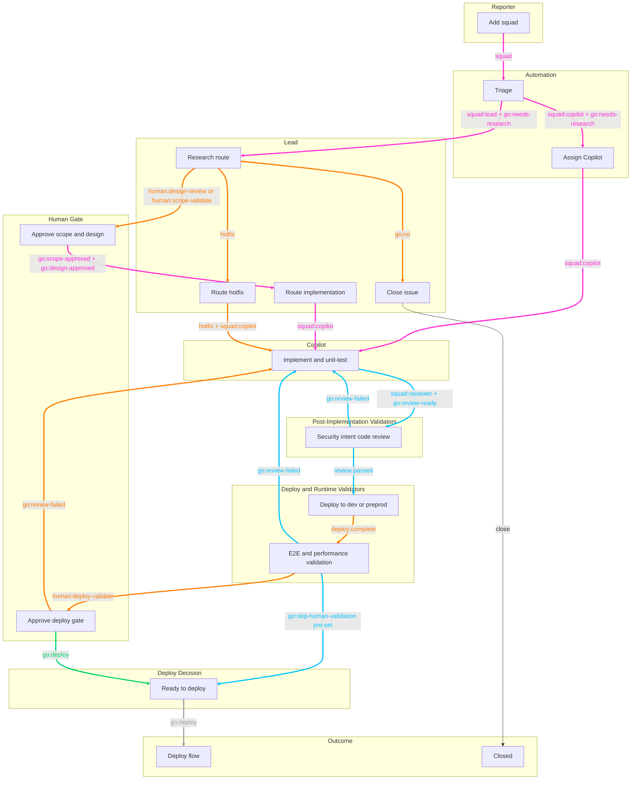
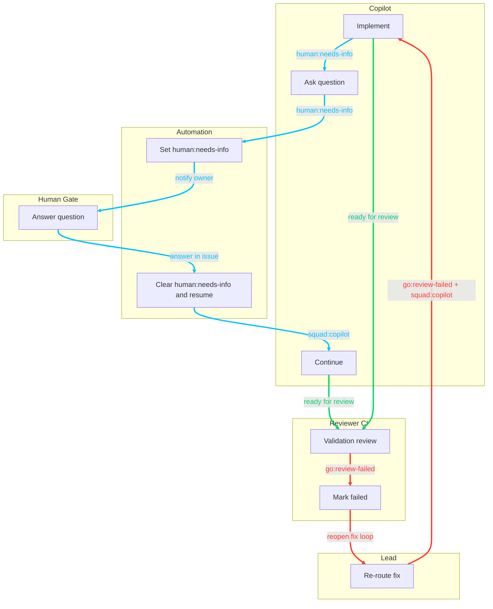

# Squad Label State Machine

## Purpose

This document is the single source of truth for issue workflow states driven by label namespaces in repositories running Squad, especially:
- `squad` and `squad:*`
- `go:*`
- `release:*`
- `type:*`
- `priority:*`
- `env:*`
- `human:*`

It also includes related operational states that directly affect coding-agent wait/resume flow.

## Scope

This state machine describes issue lifecycle behavior across the standard Squad files:
- `.github/workflows/squad-triage.yml`
- `.github/workflows/squad-issue-assign.yml`
- `.github/workflows/squad-state-transitions.yml`
- `.github/workflows/squad-copilot-delivery-loop.yml`
- `.github/workflows/squad-label-enforce.yml`
- `.github/workflows/squad-heartbeat.yml`
- `.github/workflows/sync-squad-labels.yml`
- `.github/workflows/squad-copilot-qa-loop.yml`
- `.github/workflows/squad-validator-chain.yml`
- `.github/workflows/squad-workflow-boundary-guard.yml`
- `.squad/agents/*.md`
- `.squad/routing.md`
- `.squad/team.md`

## Ownership Model

- Primary transition engine: GitHub workflow adapters operating on label events.
- Workflow role: enforce label-state progression, routing handoff, and wait/resume mechanics.
- Source of truth for behavior: this state machine plus the corresponding `.github/workflows/squad-*.yml` implementations.
- Source of truth for team composition/routing metadata: `squad.config.ts` and generated `.squad/` artifacts.

## Namespace Rules

- `go:*` labels are mutually exclusive (enforced automatically).
- `release:*` labels are mutually exclusive (enforced automatically).
- `type:*` labels are mutually exclusive (enforced automatically).
- `priority:*` labels are mutually exclusive (enforced automatically).
- `env:*` labels are environment context signals (not mutually exclusive with other namespaces).
- `human:*` labels are explicit human-gate signals and are mutually exclusive (one open gate at a time).
- `pending:*` labels are stage queue signals and are mutually exclusive (one pending stage at a time).
- `bug` and `feedback` are high-signal standalone labels managed by sync workflow.
- `squad` is inbox/triage entry; `squad:*` is assignment/routing.

## State Catalog

### Squad Namespace

| Label | Meaning | Set By | Trigger | What Must Happen In This State |
|---|---|---|---|---|
| `squad` | Issue enters squad triage inbox | Manual (user/automation) | Label added to issue | `squad-triage.yml` and/or `squad-heartbeat.yml` (Ralph smart triage) evaluate assignment and add one `squad:*` label |
| `squad:lead` | Routed to lead for coordination/triage path | Automatic or manual | Triage selects lead path, or manual correction | Lead performs triage/design/hotfix coordination and decides next routing |
| `squad:reviewer` | Routed to reviewer | Automatic or manual | Routing/assignment decision | Reviewer handles review gates and can drive promote/fail outcomes |
| `squad:quality-reviewer` | Routed to quality reviewer | Automatic or manual | Quality/architecture gap path | Quality reviewer diagnoses and drives correction workflow |
| `squad:copilot` | Routed to coding agent | Automatic or manual | Triage/lead routes coding work to Copilot | `squad-issue-assign.yml` assigns coding agent and starts implementation |

### Go Namespace

| Label | Meaning | Set By | Trigger | What Must Happen In This State |
|---|---|---|---|---|
| `go:needs-research` | Default triage verdict: investigation required | Automatic by triage or manual by lead | Added by `squad-triage.yml`/Ralph triage path or lead research hold decision | Gather missing evidence, then transition to approved/design/hotfix/no path |
| `go:yes` | Approved to implement (legacy/governance path) | Manual | Explicit approval decision | Ensure release target exists; `squad-label-enforce.yml` auto-adds `release:backlog` if missing |
| `go:no` | Not pursuing implementation | Manual | Explicit reject/defer decision | Any `release:*` labels are removed automatically |
| `go:scope-approved` | Scope approved, proceed to design | Manual gate per team/lead process | @mottych scope confirmation | Advance to design and decomposition path |
| `go:design-approved` | Design approved, proceed to implementation sub-issues | Manual gate per team/lead process | @mottych design confirmation | Create/route implementation issues |
| `go:review-ready` | Implementation complete and ready for reviewer validation stage | Lead/implementor/manual | Code complete and local/unit validation done | Route to reviewer validation lane; `squad-validator-chain.yml` evaluates configured validators and can reroute to `go:review-failed` on required failures |
| `go:skip-human-validation` | Explicit approval to skip human deploy-validation gate | Manual gate per team/lead process | @mottych risk acceptance decision | Bypass `human:deploy-validate` and move to deploy decision |
| `go:deploy` | Deployment authorized to target environment (dev or prod) | Manual/role-driven gate | Validation complete and owner acknowledgement | Execute deployment/promotion workflow for target environment |
| `go:review-failed` | CI/review/deploy failed; needs correction | Manual/role-driven or automation-linked operations | Failure diagnostics/reopen flow | Reopen corrective work, fix issue, re-run validation; auto-post short failure findings summary on issue |
| `go:changes-requested` | Human reviewer requested changes before approval | Manual/role-driven gate | Review feedback requiring implementation updates | Return to implementation loop; auto-post failure/change summary on issue |
| `go:blocked` | Autonomous recovery exhausted; issue is blocked | Automation or manual | Retry budget exhausted or unrecoverable flow failure | Add blocked context and wait for human unblock decision |
| `go:blocked-resolved` | Human resolved blocked state and selected resume target | Manual | Human comment chooses resume target and applies label | Clear blocked labels and resume to implementing, validating, or deploy path |

### Hotfix Flag (Warning)

| Label | Meaning | Set By | Trigger | What Must Happen In This State |
|---|---|---|---|---|
| `hotfix` | Production fix warning flag | Automatic or manual | Existing prod/hotfix signals or explicit decision | Use hotfix workflow from production baseline (`main`) and validate on preprod before production |

### Environment Namespace

| Label | Meaning | Set By | Trigger | What Must Happen In This State |
|---|---|---|---|---|
| `env:dev` | Work targets dev environment | Manual or triage context | Environment scoping decision | Keep validation/deploy plan aligned to dev scope |
| `env:prod` | Issue affects production environment | Manual or triage context | Incident/production-impact signal | Force lead hotfix path consideration; may add `hotfix` |

### Release Namespace

| Label | Meaning | Set By | Trigger | What Must Happen In This State |
|---|---|---|---|---|
| `release:backlog` | Not yet targeted to a version | Automatic/manual | Added directly or auto-added for `go:yes` when release target missing | Keep in backlog until explicit release target is chosen |
| `release:v0.4.0` | Targeted for v0.4.0 | Manual | Release planning decision | Deliver within v0.4.0 scope |
| `release:v0.5.0` | Targeted for v0.5.0 | Manual | Release planning decision | Deliver within v0.5.0 scope |
| `release:v0.6.0` | Targeted for v0.6.0 | Manual | Release planning decision | Deliver within v0.6.0 scope |
| `release:v1.0.0` | Targeted for v1.0.0 | Manual | Release planning decision | Deliver within v1.0.0 scope |

### Type Namespace

| Label | Meaning | Set By | Trigger | What Must Happen In This State |
|---|---|---|---|---|
| `type:feature` | New capability | Manual/triage | Feature work intake | Lead-guided feature/design path before implementation |
| `type:enhancement` | Improvement to existing capability | Manual/triage | Enhancement intake | Lead-guided enhancement path before implementation |
| `type:bug` | Defect fix | Manual/triage | Bug report intake | Route to implementation and validation flow |
| `type:spike` | Research/investigation only | Manual/triage | Uncertain scope/approach | Produce findings and implementation recommendation |
| `type:docs` | Documentation work | Manual/triage | Docs update intake | Route docs scope through review/validation flow |
| `type:chore` | Maintenance/refactor/cleanup | Manual/triage | Maintenance request | Route operational work through normal approvals |
| `type:epic` | Parent issue for decomposition | Manual | Epic planning decision | Decompose into sub-issues and track overall progress |

### Priority Namespace

| Label | Meaning | Set By | Trigger | What Must Happen In This State |
|---|---|---|---|---|
| `priority:p0` | Blocking release | Manual | Critical priority decision | Expedite triage, assignment, and validation |
| `priority:p1` | Current sprint priority | Manual | Sprint planning decision | Schedule for current sprint execution |
| `priority:p2` | Next sprint priority | Manual | Sprint planning decision | Schedule for near-term backlog execution |

### High-Signal Standalone Labels

| Label | Meaning | Set By | Trigger | What Must Happen In This State |
|---|---|---|---|---|
| `bug` | High-visibility defect signal | Manual/intake | Defect identified | Use with `type:bug` where applicable for urgency visibility |
| `feedback` | High-visibility user feedback signal | Manual/intake | Feedback report identified | Ensure triage captures user-impact context |

### Related Operational Labels (Non-go/squad, but state-critical)

| Label | Meaning | Set By | Trigger | What Must Happen In This State |
|---|---|---|---|---|
| `human:needs-info` | Waiting for reporter/owner input | Manual or automatic | Clarification required, or Copilot question detected in `squad-copilot-qa-loop.yml` | Owner responds; Q&A loop removes label and resumes agent work |
| `blocked` | Issue is blocked pending human action | Automation/manual | Unrecoverable automation path or explicit operator block | Remains blocked until `go:blocked-resolved` resumes flow |

### Pending Namespace (Stage Queue Signals)

| Label | Meaning | Set By | Trigger | Auto-clear Condition |
|---|---|---|---|---|
| `pending:implementing` | Waiting for implementation capacity slot | `squad-state-transitions.yml` | `go:design-approved` or `go:review-failed` when implementing cap is full | Removed by heartbeat admission when implementing slot opens (cap sourced from `.squad/workflow-config.json`) |
| `pending:validating` | Waiting for validation capacity slot | `squad-state-transitions.yml` | `go:review-ready` when validating cap is full | Removed by heartbeat admission when validating slot opens (cap sourced from `.squad/workflow-config.json`) |
| `pending:deploying-qa` | Waiting for QA deployment capacity slot | `squad-state-transitions.yml` | `go:deploy` for non-prod when QA deploy cap is full | Removed by heartbeat admission when QA deploy slot opens (cap sourced from `.squad/workflow-config.json`) |
| `pending:deploying-prod` | Waiting for production deployment capacity slot | `squad-state-transitions.yml` | `go:deploy` for prod/hotfix when production deploy cap is full | Removed by heartbeat admission when production deploy slot opens (cap sourced from `.squad/workflow-config.json`) |

### Automation Boundary

- `squad-triage.yml` and heartbeat Ralph smart-triage handle initial intake to lead-owned design/requirements gates.
- `squad-state-transitions.yml` handles cross-gate transitions (`go:*`, `human:*`) including Copilot routing, rework loops, deploy gating, and close-on-deploy behavior.
- `squad-copilot-delivery-loop.yml` handles Copilot PR auto-merge arming, single-path merge decisions, and deployment outcome sync to `human:deploy-validate` or `go:deploy` on success, and `go:review-failed` on failure.
- `squad-copilot-delivery-loop.yml` also watches failed Copilot PR validation workflow runs, clears PR review requests, and posts PR-level recovery guidance; issue-level `go:review-failed` reroute remains owned by `squad-validator-chain.yml`.
- `squad-validator-chain.yml` evaluates configured validators from `.squad/workflow-config.json` using PASS/FAIL/SKIP contract and applies `go:review-failed` on required validator failure.
- `squad-validator-chain.yml` runs on `go:review-ready`, manual dispatch, and validator `workflow_run` completion events to continuously re-evaluate linked review-ready issues.
- `squad-copilot-qa-loop.yml` handles Copilot clarification wait/resume (`human:needs-info`) during implementation.
- `squad-label-enforce.yml` handles namespace exclusivity and release-target hygiene, including `pending:*` labels.
- `squad-workflow-boundary-guard.yml` enforces architecture constraints defined in this repository.
- `squad-heartbeat.yml` periodically checks open `squad:copilot` issues for inactivity and posts a stall-watch alert comment that mentions the owner.
- `squad-heartbeat.yml` also admits pending stage queues by policy order (hotfix first, then priority, then age).

### Human Namespace (Explicit Human Gates)

| Label | Meaning | Set By | Trigger | Auto-clear Condition |
|---|---|---|---|---|
| `human:needs-info` | Human response required before Copilot continues | Copilot Q&A automation/lead/manual | Copilot asks a clarifying question | Removed when owner responds in issue thread |
| `human:design-review` | Human design review is required | Lead/automation/manual | Design decision required | Removed when `go:design-approved` is applied |
| `human:scope-validate` | Human scope validation is required | Lead/automation/manual | Scope decision required | Removed when `go:scope-approved` is applied |
| `human:deploy-validate` | Human deployment validation gate is required | Lead/automation/manual | Validation evidence is ready in target environment (dev or preprod) | Removed when `go:deploy` or `go:skip-human-validation` is applied |
| `human:blocked` | Human decision required to resolve blocked issue | Automation/manual | Blocked escalation path (`go:blocked`) | Removed when `go:blocked-resolved` is applied |

## Transition Map

## State Transition Diagram (STD)

Legend:
- `A:*` = Automation
- `L:*` = Lead
- `H:*` = Human gate
- `C:*` = Copilot
- `R:*` = Reviewer/CI
- `X:*` = Expert agents (optional)

### STD-1: Core Delivery Path (Compact)

### STD-2: Exception Loops (Compact)

### Primary Flow (Standard)

1. `squad` added
2. `squad-triage.yml` (or heartbeat Ralph smart-triage) assigns `squad:*` and adds `go:needs-research`
3. Lead triage/research resolves unknowns
4. Transition to approval states (`go:scope-approved`, `go:design-approved`) based on scope
5. Route execution to `squad:copilot` or squad member
6. After implementation, run post-implementation validators (security, intent alignment, code review)
7. Deploy to validation environment (dev or preprod), then run E2E + performance checks
8. If `go:skip-human-validation` is pre-set, bypass human deploy gate; otherwise use `human:deploy-validate`
9. On successful decision -> `go:deploy`
10. On failure -> `go:review-failed` and correction loop

### Hotfix Flow

1. `squad` + prod/hotfix signals
2. `squad-triage.yml`/heartbeat Ralph/lead ensures `hotfix` path routing
3. Lead hotfix triage and approval gate
4. Implement and validate hotfix path
5. Promote and backmerge per governance

### Copilot Q&A Wait/Resume Flow

1. Issue in `squad:copilot`
2. Copilot comment with question-like content
3. `squad-copilot-qa-loop.yml` adds `human:needs-info` and notifies owner
4. Owner replies in issue
5. `squad-copilot-qa-loop.yml` removes `human:needs-info` and re-assigns Copilot
6. Implementation resumes

## Additional Actors (Extensions)

### Expert Agents (security, performance, domain specialists)

- Pattern: add the member to `.squad/team.md`.
- Routing label: `squad:{member}` is created automatically by `sync-squad-labels.yml`.
- Integration point: Lead can route specific review/analysis steps to expert agents before returning work to implementation/review lanes.
- Typical examples:
  - `squad:security` for threat-model or permission boundary checks
  - `squad:performance` for load/perf profiling and optimization guidance

### Scribe

- Scribe is a background/documentation actor and normally does not gate label transitions.
- Scribe may record status and outcomes, but should not block implementation, validation, or promotion decisions.

### Human Gate Trigger Rule

- Any open `human:*` label means human intervention is required.
- Resolution model:
  - `human:needs-info` -> owner answer -> resume Copilot
  - `human:design-review` -> `go:design-approved`
  - `human:scope-validate` -> `go:scope-approved`
  - `human:deploy-validate` -> `go:deploy` (or `go:skip-human-validation`)

### Design Rework Loop (`go:changes-requested`)

`go:changes-requested` returns the issue to lead-owned design review:

1. Reviewer applies `go:changes-requested`.
2. `squad-state-transitions.yml` ensures `squad:lead` and `human:design-review` are active.
3. Lead updates design direction and requests a new `go:design-approved` decision.
4. On `go:design-approved`, `squad-state-transitions.yml` routes back to `squad:copilot`.

## Automatic vs Manual Responsibility Matrix

| Transition Type | Automatic | Manual |
|---|---|---|
| Initial squad triage | Yes (`squad-triage.yml` and scheduled/event-driven Ralph triage in `squad-heartbeat.yml`) | Optional override by lead/owner |
| Member assignment from `squad:*` | Yes (`squad-issue-assign.yml`) | Manual reassign by label swap |
| Copilot PR merge progression | Yes (`squad-copilot-delivery-loop.yml` is merge/auto-merge authority; it auto-clears requested reviewers, auto-marks drafts ready, and merges on green checks) | Optional reviewer intervention |
| Delivery loop auth | Yes (`squad-copilot-delivery-loop.yml` uses `github.token` for merge/recovery operations) | N/A |
| `go:*` exclusivity | Yes (`squad-label-enforce.yml`) | N/A |
| `release:*`, `type:*`, `priority:*`, `human:*` exclusivity | Yes (`squad-label-enforce.yml`) | N/A |
| Research hold (`go:needs-research`) | Yes (default) / manual hold | Lead/owner resolves and transitions |
| Design approval handoff (`go:design-approved`) | Yes (`squad-state-transitions.yml` routes to `squad:copilot` and assigns coding agent) | Human applies approval label |
| Design rework (`go:changes-requested`) | Yes (`squad-state-transitions.yml` restores `squad:lead` + `human:design-review`) | Human/reviewer applies changes-requested label |
| Post-merge deploy outcome (`Deploy to Dev` / `Deploy to Preprod`) | Yes (`squad-copilot-delivery-loop.yml` applies `human:deploy-validate` on success, or `go:review-failed` on failure; if `go:skip-human-validation` is present, applies `go:deploy`) | N/A |
| Review-ready deploy gate (`go:review-ready`) | Yes (`squad-state-transitions.yml` keeps issue in deploy-pending state; human gate is deferred until deployment workflow success) | Human/reviewer can apply review-ready manually |
| Skip-human path (`go:skip-human-validation`) | Yes (`squad-state-transitions.yml` clears human gate and adds `go:deploy`) | Human applies skip label |
| Review failure loop (`go:review-failed`) | Yes (`squad-state-transitions.yml` routes back to `squad:copilot`) | Human/reviewer applies failure label |
| PR validation/check failure on Copilot branch | Yes (`squad-copilot-delivery-loop.yml` performs PR-level recovery actions; `squad-validator-chain.yml` owns issue-level `go:review-failed` reroute and validator result comments) | Optional human override/comment |
| Deploy decision (`go:deploy`) | Yes (`squad-state-transitions.yml` performs routing only; `squad-repo-hygiene.yml` is the single owner of non-prod cleanup summary, Copilot branch cleanup, and final issue close) | Human/reviewer applies deploy label |
| Copilot wait/resume (`human:needs-info` loop) | Yes (`squad-copilot-qa-loop.yml`, and `squad-state-transitions.yml` for lead-phase clarification) | Owner replies to resume |
| Copilot inactivity visibility (assigned but quiet) | Yes (`squad-heartbeat.yml` stall-watch posts owner-mentioned alert comments with cooldown) | Optional owner nudge to wake Copilot |
| Copilot flow execution monitoring (Ralph) | Yes (`squad-heartbeat.yml` monitors open Copilot PR flow, clears stale reviewer requests, and reports merge readiness while leaving merge/auto-merge execution to delivery-loop) | N/A |
| Issue closure control | Yes (Copilot assignment instructions require `Related to #...` links only; no `fixes/closes/resolves` keywords; delivery loop sanitizes PR body keywords if present) | Final close remains workflow-controlled (`go:deploy`/hygiene path) |

## Workflow Label Inventory (Cleanup Safe List)

This inventory is derived from current workflow behavior and label-sync automation. Do not delete these labels unless workflows and this document are updated in the same change.

### Required Labels (Directly Used by Workflow Logic)

- `squad`
- `squad:copilot`
- `squad:{member}` (dynamic from roster)
- `go:needs-research`
- `go:yes`
- `go:no`
- `go:scope-approved`
- `go:design-approved`
- `go:review-ready`
- `go:skip-human-validation`
- `go:deploy`
- `go:review-failed`
- `go:changes-requested`
- `go:blocked`
- `go:blocked-resolved`
- `hotfix`
- `env:prod`
- `release:*` (at minimum one target or `release:backlog`)
- `type:*`
- `priority:*`
- `human:needs-info`
- `human:design-review`
- `human:scope-validate`
- `human:deploy-validate`
- `human:blocked`
- `blocked`
- `pending:implementing`
- `pending:validating`
- `pending:deploying-qa`
- `pending:deploying-prod`

### Managed By Label Sync (Should Also Be Kept)

- `env:dev`
- `release:v0.4.0`
- `release:v0.5.0`
- `release:v0.6.0`
- `release:v1.0.0`
- `release:backlog`
- `type:feature`
- `type:enhancement`
- `type:bug`
- `type:spike`
- `type:docs`
- `type:chore`
- `type:epic`
- `priority:p0`
- `priority:p1`
- `priority:p2`
- `bug`
- `feedback`

### Legacy Compatibility (Do Not Recreate, But Recognize)

- `go:hotfix` is still read by triage/heartbeat as a backward-compatibility signal; `hotfix` is the canonical current label.

## Maintenance Contract (Required)

This document must be updated in the same change whenever label-state behavior changes in any of these files:
- `.github/workflows/squad-*.yml`
- `.github/workflows/sync-squad-labels.yml`
- `.squad/workflow-config.json`
- `.squad/templates/workflows/*.yml`
- `.squad/templates/ralph-triage.js`
- `scripts/utilities/Complete-IssueWorkflow.ps1`
- `.squad/**/*.md`

Canonical path for all repos: `docs/shared/process/squad/SQUAD_LABEL_STATE_MACHINE.md`.

If behavior changes and this document is not updated, workflow policy should fail the change.

## Last Updated

- 2026-03-29
- Added hardening guardrails for upgrade safety and parity:
  - Added `.github/workflows/squad-template-sync-guard.yml` to enforce active/template workflow parity for mirrored files.
  - Synced `.squad/templates/workflows/sync-squad-labels.yml` and `.squad/templates/workflows/squad-heartbeat.yml` to active workflow behavior.
  - Added `.squad/templates/ralph-triage.js` and made heartbeat fail fast when the triage script is missing.
  - Added triage-results schema validation in heartbeat before label/comment application.
  - Centralized validator allowlist verification in `squad-validator-chain.yml` by parsing workflow-run trigger names from the workflow file instead of hardcoded script arrays.
- Refined ownership and unblock semantics:
  - `squad-copilot-delivery-loop.yml` now performs PR-level validation failure recovery only; `squad-validator-chain.yml` remains the issue-level reroute owner for `go:review-failed` on validation failures.
  - `go:blocked-resolved` resume-target parsing now accepts only implemented targets (`implementing`, `validating`, `deploying-qa`, `deploying-prod`) to prevent accidental fallthrough to deploy.
  - `squad-heartbeat.yml` flow-enforcer is now monitor-only for merge readiness; merge/auto-merge authority stays in `squad-copilot-delivery-loop.yml`.
  - Added pull-request-target fork-context safety guards in `squad-copilot-delivery-loop.yml` for merge/arm/reopen paths.
- Consolidated validation-failure routing ownership:
  - `squad-copilot-delivery-loop.yml` now keeps PR-level recovery actions, while issue-level `go:review-failed` routing remains owned by `squad-validator-chain.yml`.
- Hardened validator-chain required semantics:
  - Required validators with `SKIP` now produce `PENDING` outcome and keep `go:review-ready` until required checks complete.
- Expanded `squad-state-doc-guard.yml` coverage to include:
  - `.squad/templates/workflows/*.yml`
  - `.squad/templates/ralph-triage.js`
  - `scripts/utilities/Complete-IssueWorkflow.ps1`
- Added mandatory Windows read-only preflight behavior to `Complete-IssueWorkflow.ps1` for branch/push/merge reliability.
- Removed active `pending:merge-down` inventory from stage-cap configuration and label-sync baseline; merge-down remains a future workflow capability, not an active queue stage.
- Added per-issue concurrency guards to label-mutating workflows (`squad-triage`, `squad-issue-assign`, `squad-label-enforce`, `squad-copilot-qa-loop`, `squad-state-transitions`) and event-aware guards in `squad-heartbeat` and `squad-copilot-delivery-loop` to reduce mutation races.
- Updated heartbeat triage bootstrap behavior: missing `.squad/templates/ralph-triage.js` now degrades gracefully (smart triage skipped) instead of failing the entire heartbeat run.
- Added `workflowRunTriggerAllowlist` to `.squad/workflow-config.json` and aligned validator/delivery workflows to use config-driven trigger allowlist fallback instead of hardcoded validator-name fallback arrays.
- Hardened `.squad/templates/ralph-triage.js` with explicit routing/team input validation and fallback-quality warnings when routing quality degrades.
- Added strict stage-cap schema validation (integer, bounded, required keys) in both `squad-state-transitions.yml` and `squad-heartbeat.yml`; invalid cap config now fails fast with explicit diagnostics.
- Hardened production deploy dispatch failure path in `squad-state-transitions.yml`: failed `deploy-production.yml` dispatch now escalates to blocked state (`go:blocked`, `blocked`, `human:blocked`, `squad:lead`) with explicit operator recovery guidance.
- Reduced merge-path overlap in `squad-copilot-delivery-loop.yml`: direct merge path now runs only on `workflow_run`/`check_suite` and skips when auto-merge is already armed.
- Expanded PR closing-keyword sanitization in delivery-loop to cover both PR title and body using broader keyword spacing variants.
- Added validator trigger drift guard in `squad-validator-chain.yml` to verify `.squad/workflow-config.json` `workflowRunTriggerAllowlist` entries are represented in workflow `on.workflow_run.workflows`.
- Hardened validator trigger authority checks in `squad-validator-chain.yml`:
  - Added duplicate-name guards (case-insensitive) for both configured validators and workflow-run allowlist entries.
  - Added reverse drift enforcement so workflow-declared `on.workflow_run.workflows` entries must also exist in `.squad/workflow-config.json` `workflowRunTriggerAllowlist`.
- Tightened PR closing-keyword sanitization pattern in `squad-copilot-delivery-loop.yml` to cover punctuation/parenthesis variants while preserving non-closing `Related to #...` wording.

- 2026-03-29
- Added stage-cap queue controls:
  - `squad-state-transitions.yml` now applies `pending:*` labels when implementing/validating/deploying caps are full.
  - `squad-heartbeat.yml` now admits pending queues by policy order (hotfix first, then priority, then age).
- Stage caps are now config-driven from `.squad/workflow-config.json` (with defaults when config is missing/invalid).
- Added `squad-validator-chain.yml` to enforce validator-chain PASS/FAIL/SKIP contract and short-circuit required validator failures back to `go:review-failed`.
- Added workflow-run trigger support in `squad-validator-chain.yml` so validator completion re-checks linked `go:review-ready` issues automatically.
- Hardened `squad-validator-chain.yml` with idempotent result comments (`<!-- squad-validator-chain-result -->`) and enabled-validator filtering for `workflow_run` events to reduce duplicate/no-op churn.
- Added validator allowlist/config consistency guard in `squad-validator-chain.yml` so enabled validators must be represented in workflow-run triggers.
- Removed duplicated Copilot stall-recovery logic in `squad-heartbeat.yml` to prevent repeated retry/escalation side effects in one run.
- Updated state-doc guard scope to include `.squad/workflow-config.json` so config-driven state behavior requires accompanying state-doc updates.
- Aligned squad process guidance and completion utility with autonomous PR + auto-merge flow (no manual merge required, workflow-owned issue closure).
- Synced `.squad/templates/workflows/squad-heartbeat.yml` to active heartbeat behavior so template upgrades preserve cap-driven pending-queue admission.
- Fixed deploy-gate synchronization semantics in `squad-copilot-delivery-loop.yml`: deployment success now applies `human:deploy-validate` (or direct `go:deploy` when skip-human-validation is active) without re-applying `go:review-ready`.
- Synced `.squad/templates/workflows/squad-label-enforce.yml` to active label enforcement workflow to prevent template drift on future upgrades.
- Added blocked resolution semantics with `go:blocked-resolved` and `resume-target:` comment parsing.
- Added canonical documentation entries for `go:blocked`, `go:blocked-resolved`, `human:blocked`, and `pending:*` labels.

- 2026-03-27
- Expanded `squad-copilot-delivery-loop.yml` failure recovery semantics (historical, superseded in latest 2026-03-29 ownership update): when watched PR validation workflows failed for a Copilot-authored PR, automation cleared requested reviewers, posted an explicit recovery note on the PR thread, and performed issue-level reroute.
- Clarified non-terminal deploy-close behavior for delivery-loop automation: if a PR/issue reaches merge or deploy completion before the human deploy gate is satisfied, the issue is reopened with guidance that the required `go:review-ready` -> `human:deploy-validate` -> `go:deploy` path is still pending.
- 2026-03-20
- Simplified merge progression ownership: `squad-copilot-delivery-loop.yml` now uses check-run readiness (not combined status) and `github.token` for merge/recovery operations.
- Added Ralph flow enforcement in `squad-heartbeat.yml` (historical, superseded in latest 2026-03-29 ownership update): scheduled monitor normalized open Copilot PRs by clearing requested reviewers and arming auto-merge when non-delivery checks were green.
- Removed immediate direct-merge fallback from `arm-automerge` to reduce maintenance and permission-surface complexity.
- Updated Copilot assignment instructions to prohibit PR closing keywords; PRs must use `Related to #...` so issue closure is not triggered by merge side effects.
- Added PR body sanitization in `arm-automerge` to automatically rewrite accidental closing keywords to `Related to ...` before merge automation continues.
- 2026-03-19
- Enabled scheduled Ralph heartbeat and added Copilot stall-watch alerts in `squad-heartbeat.yml` to surface assigned-but-inactive `squad:copilot` issues via owner-mentioned comments.
- 2026-03-19
- Added automatic Copilot PR validation workflow-run failure recovery in `squad-copilot-delivery-loop.yml` (historical, superseded in latest 2026-03-29 ownership update): failed validation runs triggered issue-level reroute and recovery nudges.
- Fixed deploy-gate sequencing so `go:review-ready` no longer opens `human:deploy-validate` early; the human validation gate is now applied only after successful `Deploy to Dev`/`Deploy to Preprod` workflow completion.
- Added required post-deploy E2E validation to `Deploy to Dev`; if those tests fail, deployment workflow conclusion is failure and auto-recovery routes issue back to `go:review-failed` without manual trigger.
- Hardened `go:deploy` cleanup path in `squad-repo-hygiene.yml`: it now resolves linked PRs via issue timeline cross-references, deletes merged `copilot/*` branches, and performs final non-prod issue close in cleanup pass.
- Removed overlapping close behavior from `squad-state-transitions.yml` and local completion script handoff: `go:deploy` now hands off to hygiene for a single closure owner path.
- 2026-03-18
- Added `squad-copilot-delivery-loop.yml` for Copilot PR auto-merge arming and deployment outcome sync to `go:review-ready`/`go:review-failed`.
- Clarified that for dev/non-prod flow, successful deployment transitions to `human:deploy-validate` via `go:review-ready` automation.
- 2026-03-18
- Updated deploy outcome mapping: `squad-copilot-delivery-loop.yml` now applies `human:deploy-validate` directly on success (or `go:deploy` when `go:skip-human-validation` is set), avoiding chained workflow-trigger dependency.
- 2026-03-18
- Added `squad-state-transitions.yml` as transition adapter for design approval/rework loops, deploy gates, skip-human-validation path, and close-on-dev deploy behavior.
- Updated ownership and automation-boundary sections to reflect workflow-driven state transitions.
- 2026-03-13
- Added workflow-derived label inventory and documented missing namespaces/labels: `env:*`, `release:*`, `type:*`, `priority:*`, `go:changes-requested`, high-signal labels (`bug`, `feedback`), and legacy `go:hotfix` compatibility note.
- 2026-03-15
- Added automated design/scope rework loop for `go:changes-requested`: capture and clear active `human:design-review`/`human:scope-validate`, reassign Copilot for revision, then restore the correct human gate and clear `go:changes-requested` after revised proposal comment.
- 2026-03-13
- `squad-label-enforce.yml` now auto-posts issue-level transition summaries for `go:review-ready` and `go:review-failed`/`go:changes-requested`, including best-effort linked PR and failed-check context.
- 2026-03-13
- Guard workflows updated: `squad-state-doc-guard.yml` requires `pull-requests:read` for PR file enumeration and state-governance checks.
- 2026-03-12
- Includes Copilot Q&A wait/resume automation state (`squad-copilot-qa-loop.yml`)
